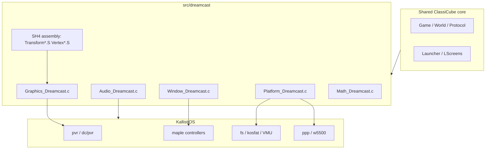

# Dreamcast Port — Work Plan

ClassiCube’s Dreamcast build is **unfinished but usable**: it boots, renders the world via the PVR2, supports multiplayer over the modem or broadband adapter, and ships in CI as a `.cdi`. This document is a practical roadmap for bringing the port closer to “finished.”

**Status (as of repo state):** playable with known gaps in graphics state, audio reliability, UI polish, and real-hardware testing coverage.

---

## Goals

| Priority | Goal |
|----------|------|
| P0 | Stable gameplay on real hardware and Flycast (no crashes, connect/disconnect reliably) |
| P1 | Fix known rendering and audio bugs called out in source TODOs |
| P2 | Improve storage, networking UX, and controller handling |
| P3 | Performance tuning (SH4 asm paths, VRAM budgeting, frame pacing) |
| P4 | Polish: dialogs, split-screen, documentation, release packaging |

---

## Architecture Overview



### Key files

| Area | File(s) | Notes |
|------|---------|-------|
| Build | `misc/dreamcast/Makefile` | KOS toolchain, ISO/CDI packaging |
| Platform | `src/dreamcast/Platform_Dreamcast.c` | FS, threads, modem/BB adapter, VMU options, crash handler |
| Window / input | `src/dreamcast/Window_Dreamcast.c` | 2D framebuffer blit, gamepad, virtual keyboard |
| Graphics | `src/dreamcast/Graphics_Dreamcast.c` | PVR2 TA lists, VRAM texture atlas, twiddled uploads |
| Vertex pipeline | `src/dreamcast/VertexSubmit.h`, `*.S` | SH4-optimized clip/submit path |
| Audio | `src/dreamcast/Audio_Dreamcast.c` | `snd_stream` backend |
| Math | `src/dreamcast/Math_Dreamcast.c`, `src/ExtMath.c` | FSCA sin/cos, libm exp2/log2 |
| UI layouts | `src/LScreens.c` | `dc_*` layouts for direct-connect screen |
| CI | `.github/workflows/build_dreamcast.yml` | `ghcr.io/classicube/minimal-kos:latest` |
| Docs / notes | `misc/dreamcast/readme.txt`, `sh4_notes.txt` | IP.BIN generation, SH4 dual-issue notes |

### Compile-time defines (`Core.h`, `PLAT_DREAMCAST`)

- `CC_BUILD_CONSOLE`, `CC_BUILD_LOWMEM`, `CC_BUILD_SPLITSCREEN`
- `CC_BUILD_MAXSTACK` = 64 KiB
- `CC_BUILD_RESOURCES` **disabled** (no embedded resource pack)
- `CC_CLIPPING_FLAGS` (per-vertex visibility in asm clipper)
- Networking: BearSSL + builtin HTTP
- Custom PVR backend (not `CC_GFX_BACKEND_*` — lives entirely in `Graphics_Dreamcast.c`)

---

## Build & Test Setup

### Prerequisites

1. [KallistiOS](https://github.com/KallistiOS/KallistiOS) with environment sourced (`environ.sh`)
2. Host tools: `mkisofs`, `cdi4dc`, KOS `scramble`
3. **IP.BIN** — not in repo (gitignored). Generate with [makeip](https://github.com/Dreamcast-Projects/makeip):
   ```bash
   makeip misc/dreamcast/ip.txt IP.BIN -l boot_logo.png
   ```
4. **classicube.zip** — default texture pack copied into ISO at build time (`misc/dreamcast/classicube.zip`); ensure this exists before `make dreamcast`

### Build

```bash
source /path/to/kos/environ.sh
make dreamcast
```

Outputs: `ClassiCube-dc.elf`, `.iso`, `.cdi`

### Test matrix

| Environment | Use for |
|-------------|---------|
| [Flycast](https://github.com/flyinghead/flycast) | Fast iteration, graphics/input regressions |
| Flycast + serial logging (`dbgio`) | Boot/network/modem traces |
| Real Dreamcast + SD adapter | FAT saves, performance, VRAM pressure |
| Real Dreamcast + BBA / modem | PPP dial-up path (~40 s init; on-screen log before window init) |
| Real Dreamcast + VMU (no SD) | `options.txt` via VMU fallback |

### CI reference

The `build_dreamcast` workflow mirrors local builds inside `minimal-kos`. Any Makefile or KOS API change should be validated there.

---

## Known Issues & Inline TODOs

Issues explicitly marked in `src/dreamcast/`:

### Graphics (`Graphics_Dreamcast.c`)

- [x] `Gfx_ClearColor` / `pvr_set_bg_color` — re-applied each frame via `ApplyBgColor`
- [ ] `SetColorWrite` — not supported on PVR2 (depth-only uses `Gfx_DepthOnlyRendering`)
- [x] `Gfx_UpdateTexture` — PVR RAM from `pvr_mem_malloc` does not need CPU cache flush
- [x] `Gfx_ClearBuffers` — applies background color when color buffer requested
- [x] `Gfx_SetViewport` — loads viewport matrix to SH4 FPU for split-screen

### Audio (`Audio_Dreamcast.c`)

- [ ] **Needs substantially more testing** (music + simultaneous sound effects)
- [x] `AudioBackend_Tick` thread-safety — `snd_stream_poll` moved to `Audio_Poll`
- [x] Sound looping / empty-buffer edge case in `AudioCallback` — skip exhausted buffers instead of null-sample hack

### Window / input (`Window_Dreamcast.c`)

- [x] Keyboard state tracked per maple port (no bleed when scanning all ports)
- [x] Mouse scanned on all maple ports (not only port 0)
- [x] Only lowest-port keyboard drives global key state
- [x] Gamepad button display names (A/B/X/Y, L/R) in controls UI
- [x] Screenshot bind unbound (was conflicting with inventory on X)
- [x] `CONT_D` no longer double-mapped to SELECT and CCPAD_7
- [ ] Analog axis deadzone / scale (`AXIS_SCALE`, threshold 8) — verify on hardware and dual-analog sticks
- [x] `Window_DrawFramebuffer` — uses `vid_flip` after 2D draw for tear-free UI
- [x] `Window_ShowDialog` — uses `VirtualDialog_Show`

### Platform (`Platform_Dreamcast.c`)

- [x] SD sync: batched via `MarkSDDirty` / `SyncSDCard` on `Platform_Free` (not per `File_Close`)
- [x] BBA + SD coexistence — `TryInitSDCard()` always runs after BBA init
- [x] Skip modem dial when SD card is mounted (offline play from SD)
- [x] VMU options path probes all maple VMU slots (not hardcoded A1 only)
- [x] VMU save checks `fs_write` result
- [x] `Directory_Enum` — `.` / `..` filtered (defensive, same as other ports)
- [x] `Socket_SetNonBlocking` — preserves flags via `F_GETFL` / `F_SETFL`
- [ ] Modem init blocks boot ~40 s with on-screen text — skipped when SD present; async init still TODO

---

## Workstreams

### 1. Stability & correctness (P0)

- [x] Fix `Gamepads_Process` early `return` → `continue` for empty maple ports
- [x] Fix `Socket_SetNonBlocking` to preserve existing `fcntl` flags
- [ ] Exercise crash handler on device (unhandled exception → register dump on screen + serial)
- [ ] Test VMU-only path: no SD card, options load/save through VMU (any slot)
- [ ] Test read-only CD root (`/cd/`) vs read-write SD root (`/sd/ClassiCube/`)
- [ ] Multiplayer smoke test: direct connect UI (`launcher-dc-*` options), join/leave, reconnect
- [ ] Verify `Game_ReduceVRAM()` path when TA runs out of vertex memory (halves view distance at ≤16 stop)

### 2. Graphics / PVR2 (P1)

The backend is a full custom implementation (~1100 lines) with:

- Three TA lists (OP / PT / TR) plus direct PT submission
- VRAM block allocator with defragmentation
- 4bpp paletted + ARGB4444 textures, twiddled layout
- SH4 asm vertex transform, clip, and store-queue submit (`VertexSubmit.h`, `VertexDraw.S`, etc.)

**Tasks:**

- [x] Fix clear color (`ApplyBgColor` each frame)
- [ ] Fix color write mask (menu backgrounds, underwater tint, damage flash)
- [x] Audit alpha test direct path — poly header always submitted before fast-path draws
- [ ] Audit alpha test / punch-through list usage (UI text, block crack overlays, vegetation)
- [x] Profile VRAM usage on large worlds — default view distance 64, cycle capped at 128, MAX_TEXTURE_COUNT 512
- [x] Validate scissor (`Gfx_SetScissor`) — PT list clips submitted immediately; full-screen clip resets TA on disable
- [x] Review fog table updates vs `gfx_fogEnabled` toggles
- [x] Confirm texture upload flush requirements after `Gfx_UpdateTexture`
- [ ] Real-hardware comparison with Flycast for Z-fighting, sorting, and translucent water

**Performance ideas (P3):**

- [ ] Profile `TransformFast.S` vs `TransformClip.S` / `TransformDirect.S` paths
- [ ] Tune `VERTEX_BUFFER_SIZE` and list buffer preallocation (`CommandsList_Reserve`)
- [ ] Consider PVR FSAA (`fsaa` flag currently `false`)
- [ ] Document twiddle format differences vs Xbox/PS3 ports (see comments in those `Graphics_*.c` files)

### 3. Audio (P1)

- [ ] Stress test: background music + block break/place + footsteps simultaneously
- [ ] Review `valid_handles[]` state machine vs KOS `snd_stream` API (see KOS PR #1099 note in source)
- [x] Resolve thread-safety of `AudioBackend_Tick` vs main audio thread
- [ ] Measure latency and buffer sizes (`AUDIO_MAX_BUFFERS`, `SND_STREAM_BUFFER_MAX`)
- [x] `StreamContext_Pause` — implemented via `snd_stream_stop`

### 4. UI, storage & networking (P2)

- [x] Implement `Window_ShowDialog` (modal message for errors / disconnect)
- [x] Double-buffer 2D framebuffer blits to reduce menu tearing (`Window_DrawFramebuffer`)
- [x] Batch SD writes (defer `fs_fat_sync` to `Platform_Free`)
- [x] Improve boot UX when no network device: START to skip wait, clearer offline messages
- [x] Document direct-connect defaults persisted in options (`launcher-dc-username`, `launcher-dc-ip`, etc.)
- [ ] W5500 adapter path: confirm coexistence with SD (serial port contention noted; init order fixed)
- [ ] Optional: ship a minimal default `classicube.zip` or build step to fetch it

### 5. Input & split-screen (P2–P3)

Dreamcast defines `CC_BUILD_SPLITSCREEN` but split-screen needs verification:

- [ ] Confirm launcher exposes split-screen entry where appropriate (`LScreens.c` / `Launcher.c` guards)
- [ ] Test 2–4 controllers with corrected `Gamepads_Process` loop
- [x] Disconnect stale gamepad state when maple port goes empty
- [ ] Verify `defaults_dc` bindings feel right (triggers = place/delete, face buttons = jump/chat/inventory)
- [ ] Keyboard / mouse via Maple: already mapped in `MapKey` — test for direct-connect typing
- [ ] Virtual keyboard path for chat when no keyboard (`SOFT_KEYBOARD_VIRTUAL`)

### 6. Build, packaging & docs (P3–P4)

- [x] Add `IP.BIN` generation instructions to main `readme.md` (currently only in `misc/dreamcast/readme.txt`)
- [x] Document `classicube.zip` requirement and minimum contents
- [x] Makefile checks for `IP.BIN` and `classicube.zip` before ISO build
- [x] Expand testing notes (`misc/dreamcast/TESTING.md`)
- [ ] Keep `minimal-kos` Docker image in sync with KOS API changes (e.g. `PVR_RAM_SIZE` non-constant note in graphics code)

---

## Suggested Implementation Order

```mermaid
gantt
  title Dreamcast port — suggested phases
  dateFormat X
  axisFormat %s

  section P0 Stability
  Gamepad loop fix           :a1, 0, 1
  Socket fcntl fix           :a2, 0, 1
  HW smoke tests             :a3, 1, 3

  section P1 Graphics
  Clear color / color write  :b1, 2, 4
  Alpha and scissor audit    :b2, 3, 5
  VRAM tuning                :b3, 4, 6

  section P1 Audio
  Multi-stream testing       :c1, 2, 5
  Threading fix              :c2, 4, 6

  section P2 Polish
  Dialogs and 2D buffering   :d1, 5, 7
  SD sync batching           :d2, 5, 6
  Network boot UX            :d3, 6, 8

  section P3 Perf
  Asm profiling              :e1, 7, 10
  TA buffer tuning           :e2, 8, 10
```



**Next focus:** hardware validation per `TESTING.md`; optional `misc/dreamcast/audio.zip` for CD sound bundling.

---

## Memory & Limits Reference

| Resource | Limit / behavior |
|----------|------------------|
| Main RAM | Low-mem build: 64×64 chunk upload radius (`Server.c`) |
| Stack | 64 KiB per thread (`CC_BUILD_MAXSTACK`) |
| VRAM | 8 MB PVR2; texture cap `512×512` per texture, block allocator with defrag |
| TA vertex buffer | `32 * 50000` bytes configured in `InitGPU` |
| View distance | Default 64; cycle options 8–128; auto-halves on VRAM OOM down to 16 |
| Textures | Max 512 GPU textures; 4bpp palette limited to 16 colors per texture |

---

## References

- [KallistiOS](https://github.com/KallistiOS/KallistiOS) — OS/SDK
- [Flycast](https://github.com/flyinghead/flycast) — emulator for development
- [makeip](https://github.com/Dreamcast-Projects/makeip) — IP.BIN generator
- [IP.BIN format](https://mc.pp.se/dc/ip.bin.html)
- ClassiCube `doc/portability.md` — general porting requirements
- Main `readme.md` — user-facing build instructions and download link

---

## Definition of Done (port “finished”)

The Dreamcast port can be considered **finished** when:

1. CI produces a bootable `.cdi` without manual steps beyond KOS toolchain
2. Single-player and multiplayer sessions run **30+ minutes** on real hardware without crash
3. Graphics TODOs (clear color, color write, scissor) are resolved or explicitly documented as hardware limits
4. Audio plays music and SFX concurrently without glitches
5. Saves work on SD; options work on VMU-only setups
6. All four controller ports work independently
7. `readme.md` status line updated from “unfinished, but usable” to “usable” or better
